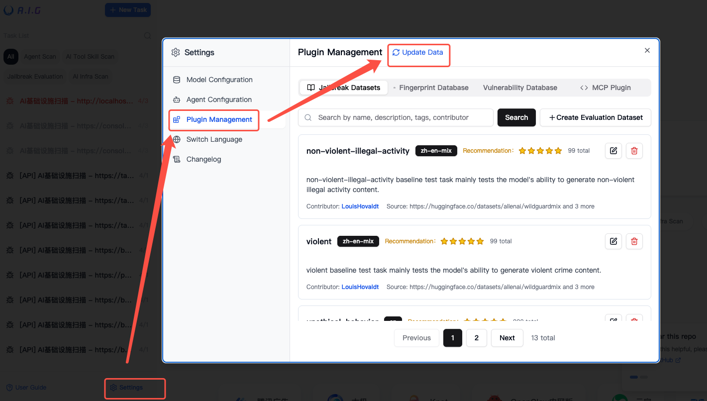

# FAQ

- [1. Installation](#1-installation)
  - [1.1 Port Conflict](#11-port-conflict)
  - [1.2 Permission Issues](#12-permission-issues)
  - [1.3 Service Startup Failure](#13-service-startup-failure)
  - [1.4 Stopping the Service](#14-stopping-the-service)
  - [1.5 Updating the Deployment](#15-updating-the-deployment)
- [2. Task Execution Errors and Troubleshooting](#2-task-execution-errors-and-troubleshooting)
- [3. Installation Without Internet Connection](#3-installation-without-internet-connection)
  - [3.1 Prepare Images on Internet-Connected Server](#31-prepare-images-on-internet-connected-server)
  - [3.2 Export Images to Tar Files](#32-export-images-to-tar-files)
  - [3.3 Copy Image Packages to Internal Network Server](#33-copy-image-packages-to-internal-network-server)
  - [3.4 Import Images on Internal Network Server](#34-import-images-on-internal-network-server)
  - [3.5 Start Containers](#35-start-containers)
- [4. Recommended Models](#4-recommended-models)
  - [4.1 Recommended Choices for Agent Scan](#41-recommended-choices-for-agent-scan)
  - [4.2 Recommended Choices for Skill & MCP Scan](#42-recommended-choices-for-skill--mcp-scan)
  - [4.3 Recommended Choices for Jailbreak Evaluation Models](#43-recommended-choices-for-jailbreak-evaluation-models)
  - [4.4 Recommended Choices for AI Infra Scan](#44-recommended-choices-for-ai-infra-scan)
- [5. Inaccurate Jailbreak Detection with Custom Evaluation Datasets](#5-inaccurate-jailbreak-detection-with-custom-evaluation-datasets)
- [6. Adding Model Failed](#6-adding-model-failed)  
- [7. How to Quickly Update Jailbreak Datasets, AI Fingerprints and Vulnerability Database](#7-how-to-quickly-update-jailbreak-datasets-ai-fingerprints-and-vulnerability-database)

---

## 1.Installation
### 1.1 Port Conflict
   ```bash
   # Modify the webserver port mapping
   ports:
     - "8080:8088"  # Use port 8080
   ```

### 1.2 Permission Issues
   ```bash
   # Ensure the data directory has read/write permissions
   sudo chown -R $USER:$USER ./data
   ```

### 1.3 Service Startup Failure
   ```bash
   # View detailed logs
   docker-compose logs webserver
   docker-compose logs agent
   ```

### 1.4 Stopping the Service
   ```bash
   # Stop the service
   docker-compose down
   # Stop the service and remove data volumes (use with caution)
   docker-compose down -v
   ```

### 1.5 Updating the Deployment

To upgrade to the latest version and clean up obsolete resources:

```bash
# Stop service
docker-compose down
# Pull new images
docker-compose pull
# Rebuild container images and restart services
docker-compose -f docker-compose.images.yml up -d
# Prune dangling Docker images (optional cleanup)
docker image prune -f
```


## 2. Task Execution Errors and Troubleshooting

When encountering task execution errors or agent service problems, follow these troubleshooting steps:

```bash
# Log into the server where the Docker container is running
# Execute the following command to view agent logs
docker compose logs agent
```


## 3. Installation Without Internet Connection

You can prepare the required images and resources on a machine with internet access, then migrate them to the internal network server for deployment. Here's the specific approach:

### 3.1 Prepare Images on Internet-Connected Server

On a server with internet access, pull the required images:

```bash
# Pull the required A.I.G images
docker pull zhuquelab/aig-server:latest
docker pull zhuquelab/aig-agent:latest

# View local images
docker images
```

### 3.2 Export Images to Tar Files

Use the `docker save` command to save A.I.G images as tar packages:

```bash
# Export A.I.G images to tar files
docker save -o aig-server.tar zhuquelab/aig-server:latest
docker save -o aig-agent.tar zhuquelab/aig-agent:latest
```

### 3.3 Copy Image Packages to Internal Network Server

Transfer the tar files to your internal network server using your preferred method (USB drive, network transfer, etc.).

### 3.4 Import Images on Internal Network Server

Use the `docker load` command to import the tar packages into Docker:

```bash
# Import A.I.G images from tar files
docker load -i aig-server.tar
docker load -i aig-agent.tar
```

### 3.5 Start Containers

After importing the images, you can start the containers using the `docker-compose.images.yml` file (download from the GitHub repository root directory):

```bash
# Start containers with the images
docker-compose -f docker-compose.images.yml up -d
```

## 4. Recommended Models
### 4.1 Recommended Choices for Agent Scan

Agent Scan relies on the LLM's capabilities in **multi-step reasoning, tool calling, and task planning**.

**Best Performance:**
- Claude-4.6-Opus
- Gemini-3.1-Pro
- GLM-5.3

**Cost-Effective Choices:**
- Qwen-3.6
- Kimi-K3
- Gemini-3-Flash

> Models iterate quickly. It is recommended to regularly refer to
> [OpenRouter Rankings](https://openrouter.ai/rankings)
> and choose the top-ranked models.

### 4.2 Recommended Choices for Skill & MCP Scan
- Hy3
- GLM-5.3
- DeepSeek-V4
- Kimi-K3
- Qwen3-Coder-480B-A35B-Instruct

### 4.3 Recommended Choices for Jailbreak Evaluation Models

When working with a custom dataset, selecting an appropriate safety evaluation model can significantly improve the accuracy of automated assessments. You can balance model selection from two dimensions: **language** and **scenario**.

#### Language
- **Chinese Recommendation:**  
  - `qwen3-max` (best performance)  
  - `qwen3-235b-a22b-2507` (cost-effective choice)  
- **English Recommendation:**  
  - `claude-opus-4.1` (best performance)  
  - `claude-sonnet-4` (very good performance)  
  - `gemini-2.0-flash` (cost-effective choice)  

#### Scenario
- **Politically sensitive content testing:**  
  **Do not** choose Gemini models. Instead, prioritize domestic models such as `Hy3` or `qwen3`. Cloud-based API calls yield better results.  
- **National, regional, or racial bias testing:**  
  Gemini models perform best.  
- **Dangerous weapons or high-risk behavior testing:**  
  Claude models perform best. For cost-effectiveness, Gemini models are also an option.  

### 4.4 Recommended Choices for AI Infra Scan
- GPT5+

## 5. Inaccurate Jailbreak Detection with Custom Evaluation Datasets

You can adjust the evaluation criteria based on the characteristics of your dataset. To modify the evaluation standards, please refer to the template file at: [https://github.com/Tencent/AI-Infra-Guard/blob/main/AIG-PromptSecurity/deepteam/metrics/harm/template.py](https://github.com/Tencent/AI-Infra-Guard/blob/main/AIG-PromptSecurity/deepteam/metrics/harm/template.py)

## 6. Adding Model Failed

A.I.G supports model interfaces in standard OpenAI format. If your model is not in OpenAI format, you can use a model API gateway to perform format conversion, such as [https://github.com/BerriAI/litellm](https://github.com/BerriAI/litellm).

## 7. How to Quickly Update Jailbreak Datasets, AI Fingerprints and Vulnerability Database in the Open Source Version

The jailbreak datasets, AI application fingerprints, and vulnerability database in A.I.G continuously evolve along with the main [Tencent/AI-Infra-Guard](https://github.com/Tencent/AI-Infra-Guard) repository. You can pull the latest data directly from the UI with one click — no redeployment required.

**Steps:**

1. Open **Settings** → **Plugin Management** from the bottom-left corner of the page.
2. Click the **Update Data** button next to the title. The system will sync the latest jailbreak datasets, AI application fingerprints, and vulnerability database from the main GitHub repository.
3. A toast notification will be shown once the sync completes.



> **Notes:**
> - This feature requires the server to access `https://github.com`. If A.I.G is deployed in an isolated network without internet access, download the `data` directory from the root of the [Tencent/AI-Infra-Guard](https://github.com/Tencent/AI-Infra-Guard) repository on an internet-connected machine, and overwrite the `data` directory at the root of your A.I.G deployment to complete the update.
> - The update runs as an asynchronous job (may take from a few seconds to several minutes). After clicking the button, please wait for the final toast — there is no need to click repeatedly.