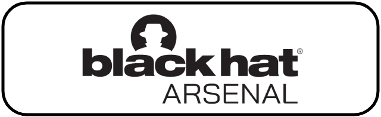
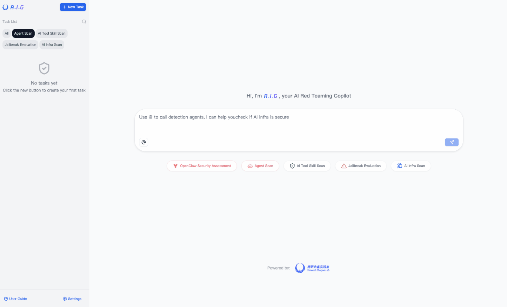
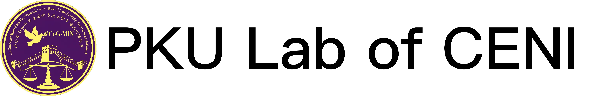
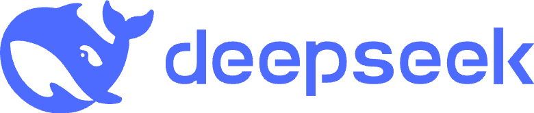
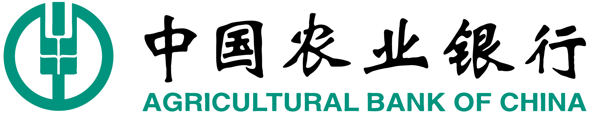
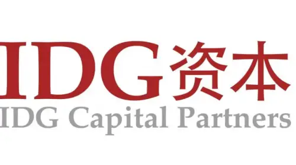
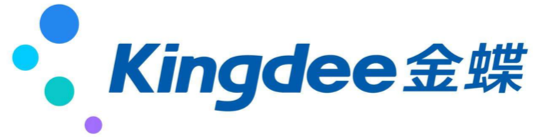
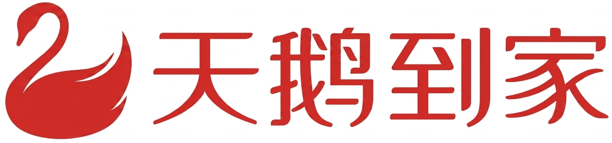
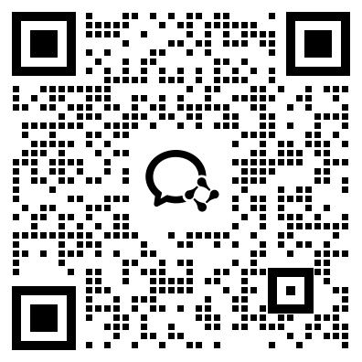
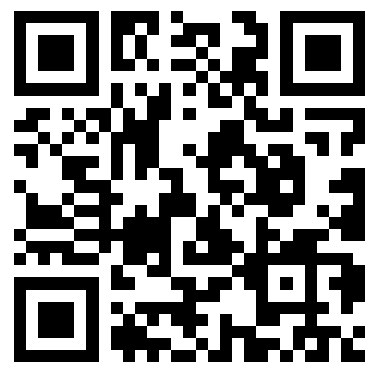

<p align="center">
    <h1 align="center"></h1>
</p>
<p align="center">
  <a href="https://tencent.github.io/AI-Infra-Guard/">📖 Документация</a> &nbsp;|&nbsp;
  🌐 <a href="../README.md">🇬🇧 English</a> · <a href="./README_ZH.md">🇨🇳 中文</a> · <a href="./README_JA.md">🇯🇵 日本語</a> · <a href="./README_ES.md">🇪🇸 Español</a> · <a href="./README_DE.md">🇩🇪 Deutsch</a> · <a href="./README_FR.md">🇫🇷 Français</a> · <a href="./README_KR.md">🇰🇷 한국어</a> · <a href="./README_PT.md">🇧🇷 Português</a> · <b>🇷🇺 Русский</b>
</p>
<p align="center">
    <a href="https://github.com/tencent/AI-Infra-Guard/stargazers">
      
    </a>
    <a href="https://github.com/Tencent/AI-Infra-Guard">
        
    </a>
    <a href="https://github.com/Tencent/AI-Infra-Guard">
        
    </a>
    <a href="https://github.com/Tencent/AI-Infra-Guard">
        
    </a>
    <a href="https://deepwiki.com/Tencent/AI-Infra-Guard">
       
    </a>
</p>
<p align="center">
    <a href="https://clawhub.ai/aigsec/edgeone-clawscan" target="_blank">
       
    </a>
    <a href="https://clawhub.ai/aigsec/edgeone-skill-scanner" target="_blank">
       
    </a>
    <a href="https://clawhub.ai/aigsec/aig-scanner" target="_blank">
       
    </a>
</p>
<p align="center">
    <a href="https://github.com/openclaw/clawscan" target="_blank">
       
    </a>
</p>
<p align="center">
  <a href="https://trendshift.io/repositories/13637" target="_blank"><picture><source media="(prefers-color-scheme: dark)" srcset="https://trendshift.io/api/badge/repositories/13637"><source media="(prefers-color-scheme: light)" srcset="https://trendshift.io/api/badge/repositories/13637"></picture></a>&nbsp;
  <a href="https://www.blackhat.com/eu-25/arsenal/schedule/index.html#aigai-infra-guard-48381" target="_blank"></a>&nbsp;
  <a href="https://github.com/deepseek-ai/awesome-deepseek-integration" target="_blank"></a>
</p>

<br>

<p align="center">
    <h2 align="center">🚀 Платформа AI Red Teaming от Tencent Zhuque Lab</h2>
</p>

<b>A.I.G (AI-Infra-Guard)</b> объединяет такие возможности, как ClawScan (сканирование безопасности OpenClaw), Agent Scan, сканирование уязвимостей AI-инфраструктуры, сканирование MCP Server и Agent Skills, а также Jailbreak Evaluation — всё это для предоставления пользователям наиболее комплексного, интеллектуального и удобного решения для самостоятельной проверки рисков безопасности ИИ.

<p>
  Мы стремимся сделать A.I.G (AI-Infra-Guard) ведущей отраслевой платформой AI red teaming. Чем больше звёзд получает проект, тем шире его аудитория и тем больше разработчиков вносят свой вклад, ускоряя итерации и улучшения. Ваша звезда имеет для нас огромное значение!
</p>
<p align="center">
  <a href="https://github.com/Tencent/AI-Infra-Guard">
      
  </a>
</p>

<br>

## 📋 Опрос пользователей

Помогите нам улучшить A.I.G! Пожалуйста, уделите 3-5 минут, чтобы заполнить наш [Опрос пользователей](https://doc.weixin.qq.com/forms/AJEAIQdfAAoAFkA0QbdAFwCNcKSO0BFLf). Пользователи, которые оставят качественный отзыв и укажут действующий адрес электронной почты, получат эксклюзивный сувенир от Tencent.

<br>

## 🚀 Новое

- **2026-09-10** · [v4.6.1](https://github.com/Tencent/AI-Infra-Guard/releases/tag/v4.6.1) — API Checker: расширенное покрытие отпечатков моделей (Gemini 2.5/3.1, Gemma 2/3/4, GLM-5.3 и GLM-5.3-Flash); надёжность MCP-Scan: помечает пустые/неполные сканы, сохраняет находки безопасности при сжатии контекста, раскрывает базовые ошибки подключения; исправлены неверно помеченные названия продуктов CVE.
- **2026-08-26** · [v4.6.0](https://github.com/Tencent/AI-Infra-Guard/releases/tag/v4.6.0) — Обнаружение отравления API LLM (мультипробный black-box аудит для подмены модели и рисков бэкдора); Agent-Scan v5.0.0 рефакторинг движка мутаций; база уязвимостей расширена до 146 AI-компонентов и 2000+ CVE-правил; исправления стабильности и совместимости сканирования MCP/Skill.
- **2026-08-17** · [v4.5.2](https://github.com/Tencent/AI-Infra-Guard/releases/tag/v4.5.2) — Skill-Scan: обнаружение обхода .pyc байт-кода + защита от charset smuggling; MCP-Scan: предотвращение RCE через белый список инструментов в динамическом режиме; новый исследовательский проект SkillJack; библиотека уязвимостей расширена до 2000+ CVE-правил.
- **2026-07-30** · [v4.5.1](https://github.com/Tencent/AI-Infra-Guard/releases/tag/v4.5.1) — Jailbreak Evaluation: 4 многоходовые атаки побега (Many-Shot, PAIR, GOAT, ActorAttack); Agent-Scan: 5 новых навыков OWASP + обнаружение веб-эксфильтрации (всего 10 навыков); MCP-Scan: 4 новых правила безопасности
- **2026-07-27** · [v4.5.0](https://github.com/Tencent/AI-Infra-Guard/releases/tag/v4.5.0) — Запущен маркетплейс навыков безопасности ИИ (3 официальных навыка); фронтенд полностью открыт; движок Skill-сканирования обновлён (9 категорий рисков, SkillTrustBench максимум 0.9848); Skill/MCP/Agent-сканирование как независимый CLI; библиотека уязвимостей расширена до 130 компонентов, 1888 правил

👉 [Предыдущие версии](../CHANGELOG.md) · 🛒 [Рынок навыков безопасности ИИ](https://matrix.tencent.com/skill-market/) · 🔍 [skill-scan CLI](https://github.com/Tencent/AI-Infra-Guard/tree/main/skill-scan) · 🔍 [mcp-scan CLI](https://github.com/Tencent/AI-Infra-Guard/tree/main/mcp-scan) · 🔍 [agent-scan CLI](https://github.com/Tencent/AI-Infra-Guard/tree/main/agent-scan) · 📊 [SkillTrustBench](https://matrix.tencent.com/skilltrustbench/)


## Содержание
- [🚀 Быстрый старт](#-быстрый-старт)
- [✨ Возможности](#-возможности)
- [🖼️ Демонстрация](#-демонстрация)
- [📖 Руководство пользователя](#-руководство-пользователя)
- [🔧 Документация API](#-документация-api)
- [🏗️ Эволюция Архитектуры](../docs/architecture_evolution.md)
- [📝 Руководство по участию](#-руководство-по-участию)
- [🛡️ О команде](#️-о-команде)
- [🙏 Благодарности](#-благодарности)
- [💬 Присоединиться к сообществу](#-присоединиться-к-сообществу)
- [📖 Цитирование](#-цитирование)
- [📚 Исследования и статьи](#-исследования-и-статьи)
- [⚖️ Лицензия и атрибуция](#️-лицензия-и-атрибуция)
<br><br>
## 🚀 Быстрый старт
### 🐳 Развёртывание с Docker

| Docker | ОЗУ | Дисковое пространство |
|:-------|:----|:----------|
| 20.10 или выше | 4 ГБ+ | 10 ГБ+ |

```bash
# Этот метод загружает готовые образы из Docker Hub для быстрого запуска
git clone https://github.com/Tencent/AI-Infra-Guard.git
cd AI-Infra-Guard
# Для Docker Compose V2+ замените 'docker-compose' на 'docker compose'
docker-compose -f docker-compose.images.yml up -d
```

После запуска сервиса веб-интерфейс A.I.G доступен по адресу:
`http://localhost:8088`
<br>

#### Использование из OpenClaw

Вы также можете вызвать A.I.G напрямую из чата OpenClaw через skill `aig-scanner`.

```bash
clawhub install aig-scanner
```

Затем настройте `AIG_BASE_URL`, указав адрес вашего запущенного сервиса A.I.G.

Подробнее см. в [README `aig-scanner`](../skills/aig-scanner/README.md).

<details>
<summary><strong>📦 Дополнительные варианты установки</strong></summary>

### Другие методы установки

**Метод 2: Скрипт установки одной командой (рекомендуется)**
```bash
# Этот метод автоматически устанавливает Docker и запускает A.I.G одной командой  
curl https://raw.githubusercontent.com/Tencent/AI-Infra-Guard/refs/heads/main/docker.sh | bash
```

**Метод 3: Сборка и запуск из исходного кода**
```bash
git clone https://github.com/Tencent/AI-Infra-Guard.git
cd AI-Infra-Guard
# Этот метод собирает Docker-образ из локального исходного кода и запускает сервис
# (Для Docker Compose V2+ замените 'docker-compose' на 'docker compose')
docker-compose up -d
```

Примечание: проект AI-Infra-Guard предназначен для использования в качестве платформы AI red teaming внутри предприятий или отдельными пользователями. В настоящее время механизм аутентификации не реализован, поэтому не следует разворачивать его в публичных сетях.

Дополнительная информация: [https://tencent.github.io/AI-Infra-Guard/?menu=getting-started](https://tencent.github.io/AI-Infra-Guard/?menu=getting-started)

</details>

### ⚡ Установите aig-skill-scan одной командой

Инструмент аудита безопасности Agent Skills, легко интегрируемый в корпоративные CI/CD пайплайны. Классификация уязвимостей соответствует таксономии [SkillTrustBench](https://matrix.tencent.com/skilltrustbench/) T01–T09. [Подробнее →](https://github.com/Tencent/AI-Infra-Guard/tree/main/skill-scan)

```bash
pip install aig-skill-scan

# Установить API-ключ через переменную окружения
export LLM_API_KEY="your-api-key"

# Сканировать локальный каталог проекта Skill
aig-skill-scan --repo /path/to/your/skill \
           -m deepseek-v4-flash \
           --language en \
           -o result.json
```

### 🌟 Попробуйте онлайн Pro-версию
Оцените Pro-версию с расширенными функциями и улучшенной производительностью. Для входа требуется [пригласительный код](https://wj.qq.com/s2/25099467/25vn/); приоритет предоставляется участникам, создавшим issues, pull request'ы или обсуждения, а также активно помогающим развивать сообщество. Перейти: [https://aigsec.ai/](https://aigsec.ai/).
<br>
<br>

## ✨ Возможности

### 🔍 Производительность и покрытие aig-skill-scan

Производительность на [SkillTrustBench](https://matrix.tencent.com/skilltrustbench/) с различными LLM:

| # | Модель | F1 | Precision | Recall | FPR |
|:--|:------|:---|:----------|:-------|:----|
| 1 | Claude Opus 4.6 | **0.9848** | 0.9725 | **0.9974** | 0.0663 |
| 2 | GLM 5.1 | 0.9836 | 0.9701 | **0.9974** | 0.0723 |
| 3 | Gemini 3.5 Flash | 0.9792 | **0.9947** | 0.9641 | **0.0120** |
| 4 | Kimi 2.6 | 0.9780 | 0.9895 | 0.9667 | 0.0241 |
| 5 | DeepSeek v4 Flash | 0.9740 | 0.9868 | 0.9615 | 0.0301 |

Покрывает 9 категорий рисков безопасности Skills (SkillTrustBench T01–T09):

| Уровень | Риски |
|:------|:--------|
| A · Инструкции и память | T01 Перехват инструкций Skill, T02 Отравление памяти |
| B · Выполнение кода | T03 Загрузка и выполнение удалённой полезной нагрузки, T04 Встроенный вредоносный код |
| C · Системные привилегии | T05 Повышение привилегий и несанкционированный доступ, T06 Системная персистентность |
| D · Цепочка инструментов и зависимости | T07 Перехват и подмена инструментов, T08 Небезопасные зависимости |
| E · Качество кода Skill | T09 Небезопасные практики программирования |

Полный рейтинг и подробности на [SkillTrustBench](https://matrix.tencent.com/skilltrustbench/).

### 🔬 Сканирование безопасности и оценка

| Функция | Подробнее |
|:--------|:------------|
| **[ClawScan (OpenClaw&nbsp;Security&nbsp;Scan)](https://matrix.tencent.com/clawscan)** | Поддерживает оценку рисков безопасности OpenClaw одним кликом. Обнаруживает небезопасные конфигурации, риски Skill, уязвимости CVE и утечки конфиденциальных данных. |
| **Agent&nbsp;Scan** | Независимый многоагентный автоматизированный фреймворк сканирования, предназначенный для оценки безопасности рабочих процессов AI Agent. Поддерживает агентов, работающих на различных платформах, включая Dify и Coze. |
| **MCP&nbsp;Server&nbsp;&&&nbsp;Agent&nbsp;Skills&nbsp;scan** | Обнаруживает 14 основных категорий рисков безопасности. Применимо как к MCP Server, так и к Agent Skills. Гибко поддерживает сканирование как из исходного кода, так и по удалённым URL. |
| **Сканирование&nbsp;уязвимостей&nbsp;AI-инфраструктуры** | Точно идентифицирует более 100 компонентов AI-фреймворков. Покрывает более 2000 известных CVE-уязвимостей. Поддерживаемые фреймворки: Ollama, ComfyUI, vLLM, n8n, Triton Inference Server и другие. |
| **Jailbreak&nbsp;Evaluation** | Оценка рисков prompt-безопасности с использованием тщательно отобранных наборов данных. Применяет несколько методов атак для проверки устойчивости. Предоставляет детальные возможности сравнения между моделями. |

<details>
<summary><strong>💎 Дополнительные преимущества</strong></summary>

- 🖥️ **Современный веб-интерфейс**: удобный UI со сканированием одним кликом и отслеживанием прогресса в реальном времени
- 🔌 **Полный API**: полная документация интерфейсов и спецификации Swagger для простой интеграции
- 🤖 **Готов к агентам**: готовые к использованию навыки агентов на ClawHub — [EdgeOne ClawScan](https://clawhub.ai/aigsec/edgeone-clawscan), [EdgeOne Skill Scanner](https://clawhub.ai/aigsec/edgeone-skill-scanner) и [AIG Scanner](https://clawhub.ai/aigsec/aig-scanner) — бесшовно встраивайте сканирование безопасности в любой рабочий процесс ИИ-агентов
- 🌐 **Мультиязычность**: интерфейсы на китайском и английском языках с локализованной документацией
- 🐳 **Кроссплатформенность**: поддержка Linux, macOS и Windows с развёртыванием на основе Docker
- 🆓 **Бесплатно и с открытым исходным кодом**: полностью бесплатно по лицензии Apache 2.0
</details>

<br />


## 🖼️ Демонстрация

### Главный интерфейс A.I.G


### Управление плагинами


<br />


## 🗺️ Краткое руководство по использованию

> После развёртывания откройте в браузере `http://localhost:8088`.

### Сканирование уязвимостей AI-инфраструктуры

**Что вводить в качестве целевого URL / IP?**

Целью является **сетевой адрес работающего AI-сервиса**, который вы хотите проверить — не URL на GitHub и не путь к исходному коду. A.I.G подключается к работающему сервису и идентифицирует его для поиска известных CVE-уязвимостей.

| Сценарий | Пример цели |
|:---------|:--------------|
| Локально запущенный экземпляр vLLM | `http://127.0.0.1:8000` |
| Сервер Ollama в локальной сети | `http://192.168.1.100:11434` |
| Экземпляр ComfyUI, доступный внутри сети | `http://10.0.0.5:8188` |
| Несколько хостов (по одному на строку) | `192.168.1.0/24` (CIDR), `10.0.0.1-10.0.0.20` (диапазон) |

**Пошагово: сканирование локального экземпляра vLLM**

1. Запустите vLLM обычным способом (например, `python -m vllm.entrypoints.api_server --model meta-llama/...`)
2. В веб-интерфейсе A.I.G нажмите **«AI基础设施安全扫描 / AI Infra Scan»**
3. Введите `http://127.0.0.1:8000` (или IP/порт, на котором слушает vLLM)
4. Нажмите **Start Scan** — A.I.G идентифицирует сервис и сопоставит его с 2000+ известными CVE
5. Просмотрите отчёт: версия компонента, найденные уязвимости, степень серьёзности и ссылки на исправления

> 💡 **Совет**: чтобы проверить именно *nightly*-сборку vLLM, просто запустите её и укажите A.I.G её адрес. Сканер определит версию автоматически.

### Сканирование MCP Server и Agent Skills

Введите **удалённый URL** (например, `https://github.com/user/mcp-server`) или **загрузите локальный архив с исходным кодом** — работающий экземпляр не требуется.

### Jailbreak Evaluation

Настройте API-эндпоинт целевого LLM (базовый URL + ключ API) в разделе **Settings → Model Config**, затем выберите набор данных и запустите оценку.

---

## 📖 Руководство пользователя

Онлайн-документация: [https://tencent.github.io/AI-Infra-Guard/](https://tencent.github.io/AI-Infra-Guard/)

Расширенные FAQ и руководства по устранению неполадок доступны в [документации](https://tencent.github.io/AI-Infra-Guard/?menu=faq).
<br />
<br>

## 🔧 Документация API

A.I.G предоставляет полный набор API для создания задач, поддерживающий возможности сканирования AI-инфраструктуры, сканирования MCP Server и Jailbreak Evaluation.

После запуска проекта посетите `http://localhost:8088/docs/index.html` для просмотра полной документации API.

Подробные инструкции по использованию API, описания параметров и примеры кода см. в [полной документации API](../api.md).
<br />
<br>

## 📝 Руководство по участию

Расширяемый фреймворк плагинов является архитектурной основой A.I.G и открыт для инноваций сообщества через вклад плагинов и новых функций.

### Правила участия в разработке плагинов
1.  **Правила отпечатков (Fingerprint Rules)**: добавьте новые YAML-файлы отпечатков в директорию `data/fingerprints/`.
2.  **Правила уязвимостей**: добавьте новые правила сканирования уязвимостей в директорию `data/vuln/`.
3.  **MCP-плагины**: добавьте новые правила сканирования безопасности MCP в директорию `data/mcp/`.
4.  **Наборы данных для Jailbreak Evaluation**: добавьте новые наборы данных для оценки в директорию `data/eval`.

Ориентируйтесь на существующие форматы правил, создавайте новые файлы и отправляйте их через Pull Request.

### Другие способы внести вклад
- 🐛 [Сообщить об ошибке](https://github.com/Tencent/AI-Infra-Guard/issues)
- 💡 [Предложить новую функцию](https://github.com/Tencent/AI-Infra-Guard/issues)
- ⭐ [Улучшить документацию](https://github.com/Tencent/AI-Infra-Guard/pulls)
<br />
<br />

## 🛡️ О команде

Этот проект разрабатывается под руководством **Tencent Zhuque Lab** — подразделения Tencent Security Platform Department. Основанная в 2019 году, лаборатория [Tencent Zhuque Lab](https://matrix.tencent.com/) является ведущей лабораторией исследований в области безопасности, специализирующейся на практических наступательных и оборонительных исследованиях и передовых технологиях в сфере безопасности ИИ. Направления исследований охватывают безопасность больших языковых моделей, безопасность ИИ-агентов, безопасность с применением ИИ и обнаружение контента, сгенерированного ИИ.

Команда помогла таким крупным вендорам, как **NVIDIA, Google и Microsoft**, а также таким сообществам открытого кода, как **OpenClaw, Linux и Hugging Face**, устранить большое количество критических уязвимостей и получила официальные публичные благодарности.

Команда выпустила открытые продукты по безопасности ИИ, включая платформу тестирования безопасности AI Red Team <b>A.I.G (AI-Infra-Guard)</b> и **Zhuque AI Detection Assistant**. Результаты исследований широко публикуются на ведущих международных конференциях по безопасности и ИИ, таких как **Black Hat, DEF CON, ICLR, CVPR, NeurIPS и ACL**, а также авторами выпущена книга *«AI Security: Technology and Practice»*.

### 👥 Ключевые участники и вклад

| Роль | Участник | Вклад |
| --- | --- | --- |
| Руководитель Tencent Security Platform Department | **Yong Yang** | Инициировал A.I.G и предложил направление автоматизированной оценки рисков потери контроля над ИИ-агентами, продвигая расширение платформы со сканирования уязвимостей инфраструктуры ИИ до оценки рисков выполнения агентов, злоупотребления инструментами и границ полномочий. |
| Руководитель Tencent Zhuque Lab | **Xing Zheng** | Предложил механизм автоматического обновления уязвимостей и согласования бенчмарков, что обеспечивает непрерывную итерацию фингерпринтов AI Infra, правил CVE/GHSA и системы бенчмарков. |
| Руководитель проекта | **Nicky** | Передовые исследования в области безопасности, планирование продукта, принятие решений по технической дорожной карте, внутреннее и внешнее взаимодействие и коммуникации. |
| Технический руководитель | **Python** | Проектирование общей архитектуры, разработка ключевых модулей и итерация версий. |
| Основной контрибьютор | **Zona** | Frontend-взаимодействие, пользовательский опыт продукта, работа с сообществом и замкнутый цикл обратной связи с пользователями. |
| Основной контрибьютор | **Fyoung** | Обновление фингерпринтов уязвимых компонентов AI Infra и построение системы бенчмарков. |
| Основной контрибьютор | **Xiangfan** | Разработка средств безопасности для рисков, связанных со Skill, и сценариев потери контроля над агентами. |
| Основной контрибьютор | **Elwood** | Усиление возможностей сканирования безопасности агентов и обновление технических отчетов. |
| Основной контрибьютор | **Robert** | Оценка безопасности LLM и операционная работа над стратегиями оценки джейлбрейка. |
| Основной контрибьютор | **Zoe** | Оценка безопасности LLM, оценка джейлбрейка и разработка модуля интеграции моделей. |
| Контрибьютор | **Ronin** | Участвовал в разработке сканирования безопасности ИИ-агентов. |
| Контрибьютор | **Rsin** | Участвовал в работе сообщества и коммуникациях по кампаниям. |

<br />

## 🙏 Благодарности

### 🎓 Академические партнёрства

Благодарим наших академических партнёров за их научный вклад и техническую поддержку.

#### 
<table>
  <tr>
    <td align="center" width="90">
      <a href="#">
        
      </a>
      <br />
      <a href="#">
        <sub><b>Prof.&nbsp;hui&nbsp;Li</b></sub>
      </a>
    </td>
    <td align="center" width="90">
      <a href="https://github.com/TheBinKing">
        
      </a>
      <br />
      <a href="mailto:1546697086@qq.com">
        <sub><b>Bin&nbsp;Wang</b></sub>
      </a>
    </td>
    <td align="center" width="90">
      <a href="https://github.com/KPGhat">
        
      </a>
      <br />
      <a href="mailto:kpghat@gmail.com">
        <sub><b>Zexin&nbsp;Liu</b></sub>
      </a>
    </td>
    <td align="center" width="90">
      <a href="https://github.com/GioldDiorld">
        
      </a>
      <br />
      <a href="mailto:g.diorld@gmail.com">
        <sub><b>Hao&nbsp;Yu</b></sub>
      </a>
    </td>
    <td align="center" width="90">
      <a href="https://github.com/Jarvisni">
        
      </a>
      <br />
      <a href="mailto:719001405@qq.com">
        <sub><b>Ao&nbsp;Yang</b></sub>
      </a>
    </td>
    <td align="center" width="90">
      <a href="https://github.com/Zhengxi7">
        
      </a>
      <br />
      <a href="mailto:linzhengxi7@126.com">
        <sub><b>Zhengxi&nbsp;Lin</b></sub>
      </a>
    </td>
  </tr>
</table>

#### 

<table>
  <tr>
    <td align="center" width="120">
      <a href="https://yangzhemin.github.io/">
        
      </a>
      <br />
      <a href="mailto:yangzhemin@fudan.edu.cn">
        <sub><b>Prof.&nbsp;Zhemin&nbsp;Yang</b></sub>
      </a>
    </td>
    <td align="center" width="100">
      <a href="https://github.com/kangwei-zhong">
        
      </a>
      <br />
      <a href="mailto:kwzhong23@m.fudan.edu.cn">
        <sub><b>Kangwei&nbsp;Zhong</b></sub>
      </a>
    </td>
    <td align="center" width="90">
      <a href="https://github.com/MoonBirdLin">
        
      </a>
      <br />
      <a href="mailto:linjp23@m.fudan.edu.cn">
        <sub><b>Jiapeng&nbsp;Lin</b></sub>
      </a>
    </td>
    <td align="center" width="90">
      <a href="https://vanilla-tiramisu.github.io/">
        
      </a>
      <br />
      <a href="mailto:csheng25@m.fudan.edu.cn">
        <sub><b>Cheng&nbsp;Sheng</b></sub>
      </a>
    </td>
  </tr>
</table>
<br>

### 👥 Благодарность разработчикам-участникам
Благодарим всех разработчиков, внёсших вклад в проект A.I.G.
<br />
<table border="0" cellspacing="0" cellpadding="0">
  <tr>
    <td width="33%"></td>
    <td width="33%"></td>
    <td width="33%"></td>
  </tr>
</table>
<a href="https://github.com/Tencent/AI-Infra-Guard/graphs/contributors">
  
</a>
<br>
<br>

### 🤝 Признательность нашим пользователям

Благодарим пользователей из следующих компаний и команд за использование A.I.G и ценные отзывы.

<br>
<div align="center">












</div>

<div align="center">


</div>

<br>

## 💬 Присоединиться к сообществу

### 🌐 Онлайн-обсуждения
- **GitHub Discussions**: [присоединяйтесь к обсуждениям в сообществе](https://github.com/Tencent/AI-Infra-Guard/discussions)
- **Issues и сообщения об ошибках**: [сообщить о проблеме или предложить функцию](https://github.com/Tencent/AI-Infra-Guard/issues)

### 📱 Сообщество
<table>
  <thead>
  <tr>
    <th>WeChat Group</th>
    <th>Discord <a href="https://discord.gg/U9dnPnyadZ">[ссылка]</a></th>
  </tr>
  </thead>
  <tbody>
  <tr>
    <td></td>
    <td></td>
  </tr>
  </tbody>
</table>

### 📧 Связаться с нами
По вопросам сотрудничества или обратной связи пишите нам: [zhuque@tencent.com](mailto:zhuque@tencent.com)

### 🔗 Рекомендуемые инструменты безопасности
Если вас интересует безопасность кода, ознакомьтесь с [A.S.E (AICGSecEval)](https://github.com/Tencent/AICGSecEval) — первым в отрасли фреймворком для оценки безопасности AI-генерированного кода на уровне репозитория, выпущенным Tencent Wukong Code Security Team с открытым исходным кодом.


<br>
<br>

## 📖 Цитирование

Если вы используете A.I.G в своих исследованиях, пожалуйста, цитируйте так:

```bibtex
@misc{Tencent_AI-Infra-Guard_2025,
  author={{Tencent Zhuque Lab}},
  title={{AI-Infra-Guard: A Comprehensive, Intelligent, and Easy-to-Use AI Red Teaming Platform}},
  year={2025},
  howpublished={GitHub repository},
  url={https://github.com/Tencent/AI-Infra-Guard}
}
```
<br>

## 📚 Исследования и статьи

**Research:**

1. **"DeepSeek Harness Indirect Prompt-Injection Assessment"** — Авторизованная оценка безопасности DeepSeek Harness против косвенного внедрения промптов на 14 560 запусках агентов. [[code]](../Research/deepseek-harness-security-assessment)

2. **"SkillJack: Persistent Skill Backdoors in Self-Evolving Agents"** — Демонстрирует, как отравленные траектории могут внедрять персистентные бэкдоры в системы навыков саморазвивающихся агентов. [[code]](../Research/SkillJack)

**Papers:**

1. **"Securing the AI Agent: A Unified Framework for Multi-Layer Agent Red Teaming"** — Комплексный фреймворк для защиты систем ИИ-агентов с помощью многоуровневого красного тестирования инфраструктуры, цепочки поставок, взаимодействия во время выполнения и поверхностей развёртывания. [[arXiv]](https://arxiv.org/pdf/2606.31227) [[pdf]](../Securing_the_AI_Agent.pdf)

2. **"AI-Infra-Guard: An AI Red Teaming Platform"** — Презентация на Black Hat Europe 2025 Arsenal с обзором возможностей A.I.G и реальных сценариев использования. [[pdf]](../Arsenal-BHEU2025-AI-Infra-Guard.pdf)

3. **"MCP Unchained: Compromising The AI Agent Ecosystem Via Its Universal Connector"** — Доклад на Black Hat Europe 2025, раскрывающий риски безопасности протокола MCP в экосистеме ИИ-агентов. [[pdf]](../BHEU-25-MCP-Unchained-Compromising-The-AI-Agent-Ecosystem-Via-Its-Universal-Connector.pdf)

Благодарим исследовательские команды, цитировавшие A.I.G в своих академических работах (19 работ):

<details>
<summary>📄 Показать все 19 цитируемых статей</summary>

1. Chenning Li, Pan Hu, Justin Xu et al. **"ADR: An Agentic Detection System for Enterprise Agentic AI Security."** arXiv preprint arXiv:2605.17380 (2026). [[pdf]](http://arxiv.org/abs/2605.17380v1)

2. Zhaojiacheng Zhou. **"Proteus: A Self-Evolving Red Team for Agent Skill Ecosystems."** arXiv preprint arXiv:2605.11891 (2026). [[pdf]](http://arxiv.org/abs/2605.11891v1)

3. Hengkai Ye, Zhechang Zhang, Jinyuan Jia et al. **"TRUSTDESC: Preventing Tool Poisoning in LLM Applications via Trusted Description Generation."** arXiv preprint arXiv:2604.07536 (2026). [[pdf]](https://arxiv.org/abs/2604.07536)

4. Zenghao Duan, Yuxin Tian, Zhiyi Yin et al. **"SkillAttack: Automated Red Teaming of Agent Skills through Attack Path Refinement."** arXiv preprint arXiv:2604.04989 (2026). [[pdf]](https://arxiv.org/abs/2604.04989)

5. Yiheng Huang, Zhijia Zhao, Bihuan Chen et al. **"From Component Manipulation to System Compromise: Understanding and Detecting Malicious MCP Servers."** arXiv preprint arXiv:2604.01905 (2026). [[pdf]](https://arxiv.org/abs/2604.01905)

6. Yi Ting Shen, Kentaroh Toyoda, Alex Leung. **"MCP-38: A Comprehensive Threat Taxonomy for Model Context Protocol Systems (v1.0)."** arXiv preprint arXiv:2603.18063 (2026). [[pdf]](https://arxiv.org/abs/2603.18063)

7. Yuepeng Hu, Yuqi Jia, Mengyuan Li et al. **"MalTool: Malicious Tool Attacks on LLM Agents."** arXiv preprint arXiv:2602.12194 (2026). [[pdf]](https://arxiv.org/abs/2602.12194)

8. Naen Xu, Jinghuai Zhang, Ping He et al. **"FraudShield: Knowledge Graph Empowered Defense for LLMs against Fraud Attacks."** arXiv preprint arXiv:2601.22485v1 (2026). [[pdf]](http://arxiv.org/abs/2601.22485v1)

9. Ruiqi Li, Zhiqiang Wang, Yunhao Yao et al. **"MCP-ITP: An Automated Framework for Implicit Tool Poisoning in MCP."** arXiv preprint arXiv:2601.07395v1 (2026). [[pdf]](http://arxiv.org/abs/2601.07395v1)

10. Jingxiao Yang, Ping He, Tianyu Du et al. **"HogVul: Black-box Adversarial Code Generation Framework Against LM-based Vulnerability Detectors."** arXiv preprint arXiv:2601.05587v1 (2026). [[pdf]](http://arxiv.org/abs/2601.05587v1)

11. Teofil Bodea, Masanori Misono, Julian Pritzi et al. **"Trusted AI Agents in the Cloud."** arXiv preprint arXiv:2512.05951v1 (2025). [[pdf]](http://arxiv.org/abs/2512.05951v1)

12. Yunyi Zhang, Shibo Cui, Baojun Liu et al. **"Beyond Jailbreak: Unveiling Risks in LLM Applications Arising from Blurred Capability Boundaries."** arXiv preprint arXiv:2511.17874v2 (2025). [[pdf]](http://arxiv.org/abs/2511.17874v2)

13. Bin Wang, Zexin Liu, Hao Yu et al. **"MCPGuard: Automatically Detecting Vulnerabilities in MCP Servers."** arXiv preprint arXiv:2510.23673v1 (2025). [[pdf]](http://arxiv.org/abs/2510.23673v1)

14. Weibo Zhao, Jiahao Liu, Bonan Ruan et al. **"When MCP Servers Attack: Taxonomy, Feasibility, and Mitigation."** arXiv preprint arXiv:2509.24272v1 (2025). [[pdf]](http://arxiv.org/abs/2509.24272v1)

15. Ping He, Changjiang Li, et al. **"Automatic Red Teaming LLM-based Agents with Model Context Protocol Tools."** arXiv preprint arXiv:2509.21011 (2025). [[pdf]](https://arxiv.org/abs/2509.21011)

16. Christian Coleman. **"Behavioral Detection Methods for Automated MCP Server Vulnerability Assessment."** (2025). [[pdf]](https://digitalcommons.odu.edu/cgi/viewcontent.cgi?article=1138&context=covacci-undergraduateresearch)

17. Yixuan Yang, Daoyuan Wu, Yufan Chen. **"MCPSecBench: A Systematic Security Benchmark and Playground for Testing Model Context Protocols."** arXiv preprint arXiv:2508.13220 (2025). [[pdf]](https://arxiv.org/abs/2508.13220)

18. Yongjian Guo, Puzhuo Liu, et al. **"Systematic Analysis of MCP Security."** arXiv preprint arXiv:2508.12538 (2025). [[pdf]](https://arxiv.org/abs/2508.12538)

19. Zexin Wang, Jingjing Li, et al. **"A Survey on AgentOps: Categorization, Challenges, and Future Directions."** arXiv preprint arXiv:2508.02121 (2025). [[pdf]](https://arxiv.org/abs/2508.02121)

</details>

📧 Если вы использовали A.I.G в своих исследованиях или продукте, либо если мы случайно пропустили вашу публикацию — мы будем рады получить от вас весточку! [Свяжитесь с нами](#-присоединиться-к-сообществу).
<br>
<br>

## ⚖️ Лицензия и атрибуция

Проект распространяется с открытым исходным кодом под лицензией **Apache License 2.0**. Мы приветствуем и поощряем вклад сообщества, интеграции и производные работы при соблюдении следующих требований к атрибуции:

1. **Сохранение уведомлений**: в любом дистрибутиве необходимо сохранять файлы `LICENSE` и `NOTICE` из оригинального проекта.
2. **Атрибуция продукта**: если вы интегрируете основной код, компоненты или движок сканирования AI-Infra-Guard в свой проект с открытым исходным кодом, коммерческий продукт или внутреннюю платформу, необходимо чётко указать следующее в **документации продукта, руководстве пользователя или странице «О программе» в UI**:
   > «Данный проект интегрирует [AI-Infra-Guard](https://github.com/Tencent/AI-Infra-Guard), выпущенный с открытым исходным кодом компанией Tencent Zhuque Lab.»
3. **Академические и статейные ссылки**: если вы используете этот инструмент в отчётах об анализе уязвимостей, статьях по безопасности или научных работах, явно упомяните «Tencent Zhuque Lab AI-Infra-Guard» и включите ссылку на репозиторий.

Переупаковка данного проекта в качестве оригинального продукта без раскрытия его источника строго запрещена.

<div>

<a href="https://www.star-history.com/?type=date&repos=Tencent%2FAI-Infra-Guard">
 <picture>
 <source media="(prefers-color-scheme: dark)" srcset="https://api.star-history.com/chart?repos=Tencent/AI-Infra-Guard&type=date&theme=dark&legend=top-left&sealed_token=3aux6V5PKs5SBSuoVgw6MReXo5IzleLoV22UkaLZtWuN6kK4PltQDiq-hrtHpF4smNRGO9dbhrjk9Q4m7FWsPPUQqIsQUUrZkwev7vTDanFVCAHfU1qusQ" />
 <source media="(prefers-color-scheme: light)" srcset="https://api.star-history.com/chart?repos=Tencent/AI-Infra-Guard&type=date&legend=top-left&sealed_token=3aux6V5PKs5SBSuoVgw6MReXo5IzleLoV22UkaLZtWuN6kK4PltQDiq-hrtHpF4smNRGO9dbhrjk9Q4m7FWsPPUQqIsQUUrZkwev7vTDanFVCAHfU1qusQ" />
 
 </picture>
</a>
</div>
